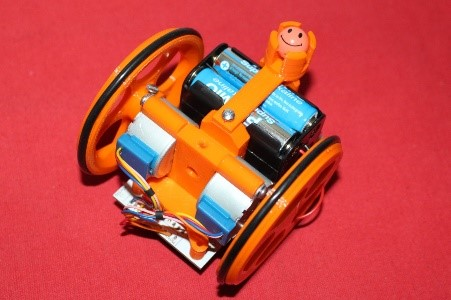
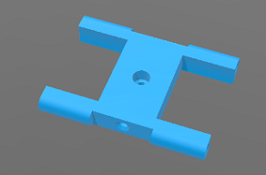
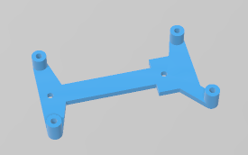
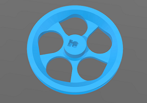
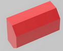
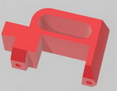

# Escornabot-Singularis

Es tracta d'una copia de l'estructura original i una adaptació per utilitzar una bateria recarregable. 

Realitzada per [Jordi Mayné](https://github.com/maynej) des de Mechatronic Study 

Escornabot es un projecte obert (https://escornabot.com) 

 

El [Manual es pot trobar en PDF](https://github.com/maynej/Escornabot-Singularis/tree/master/DOC/). Inclós en llengua castellana, francés i anglès.

El [Funcionament del firmware es pot trobar en PDF](https://github.com/maynej/Escornabot-Singularis/tree/master/Funcionament/).

També es pot programar amb Arduinoblocks 
de mans de [Manuel Hidalgo](https://github.com/maynej/Escornabot-Singularis/tree/master/Arduinoblocks/). 

STL per imprimir [aquí](https://github.com/maynej/Escornabot-Singularis/tree/master/STL).

Material recopilat de [Xoan Sampaiño](https://github.com/xoan), [Rafa Couto](https://github.com/rafacouto), [XDeSIG](https://github.com/xdesig), [Jorge Lobo Martínez](https://github.com/lobotic) i [mgesteiro](https://github.com/mgesteiro)   
  
# Escornabot Singularis
  
Descripció         | Imatge          | STL         
------------- | ------------- | ------------- 
Suport bola| | [Suport bola](STL/ballcaster-v2.stl)  
Suport piles| | [Suport piles](STL/battery-bracket.stl)  
Suport motors| | [Suport Motors](STL/MotorBracket.stl)  
Suport CPU| | [Suport CPU](STL/cpu-2_10-bracket.stl)  
Roda esquerra| | [Roda esquerra](STL/wheel-l.stl)  
Roda dreta| | [Roda dreta](STL/wheel-r.stl)  
  
### Opcións Bateria (explicat en el Manual)
  
Descripció         | Imatge          | STL          
------------- | ------------- | ------------- 
Afegit per Bateria| | [Afegit bateria](STL/TopeBateria9V.stl)  
Suport Bateria| | [Suport bateria](STL/BatteryBallcaster2.stl)  

## QR

## Llicència

Creative Commons Attribution-NoComercial-ShareAlike 4.0 International (CC BY-NC-SA 4.0)  

